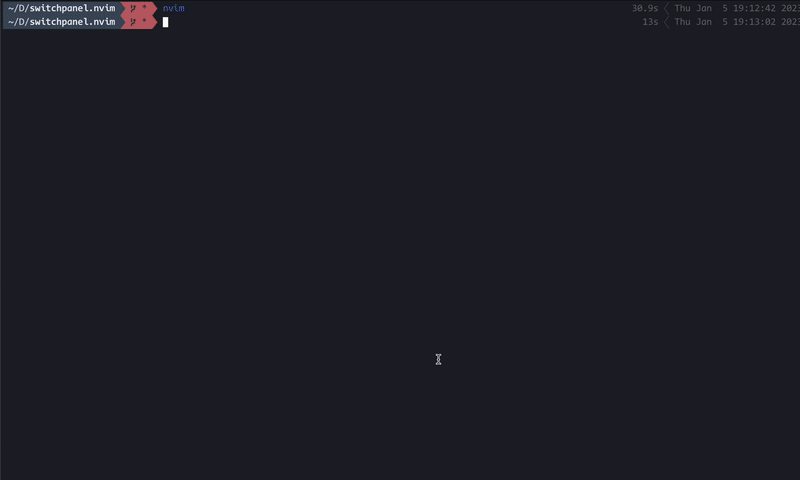

# SwitchPanel.nvim
Integrate a plugin to display NeoVim sidebars and switch between them like a VSCode sidebar.

## demo


## Requirements
- [nvim-tree](https://github.com/nvim-tree/nvim-tree.lua)
- [sidevar.nvim](https://github.com/sidebar-nvim/sidebar.nvim)
- [undotree](https://github.com/mbbill/undotree)
## Instration
Using packer
```
use({
	"arakkkkk/switchpanel.nvim",
	config = function()
		require("switchpanel").setup({})
	end,
})
```

and setup option
```
{
	panel_list = {
		show = true,
		background = "Blue",
		selected = "LightBlue",
		color = "none",
	},

	width = 30,

	focus_on_open = true,

	tab_repeat = true,
	
	mappings = {
		{"1", "SwitchPanelSwitch 1" },
		{"2", "SwitchPanelSwitch 2" },
		{"3", "SwitchPanelSwitch 3" },
		-- {"4", "SwitchPanelSwitch 4" },
		-- {"5", "SwitchPanelSwitch 5" },
		{"J", "SwitchPanelNext" },
		{"K", "SwitchPanelPrevious" }, },

	builtin = {
		"nvim-tree.lua",
		"sidebar.nvim",
		"undotree",
	}
}
```

## Usage
```
vim.keymap.set("n", "<leader>e", "<cmd>SwitchPanelToggle<CR>")
```
or
```
:SwitchPanelToggle
```

and you can switch sidebar contents by K and J or number 1~3.

